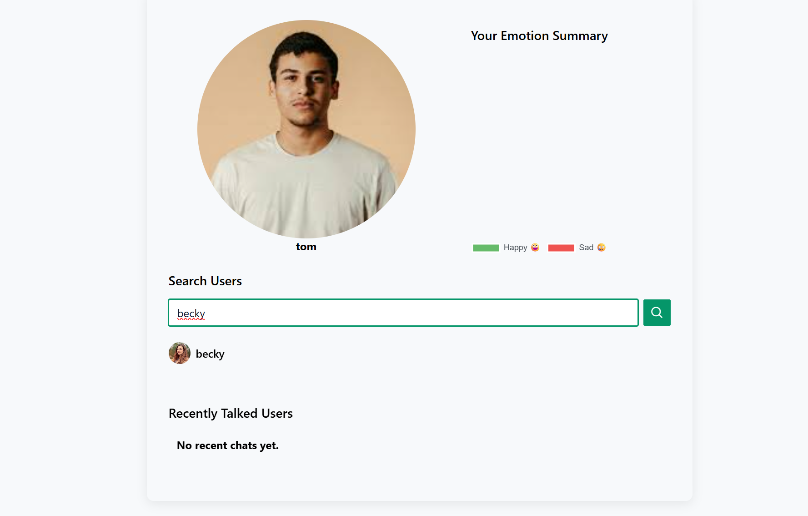
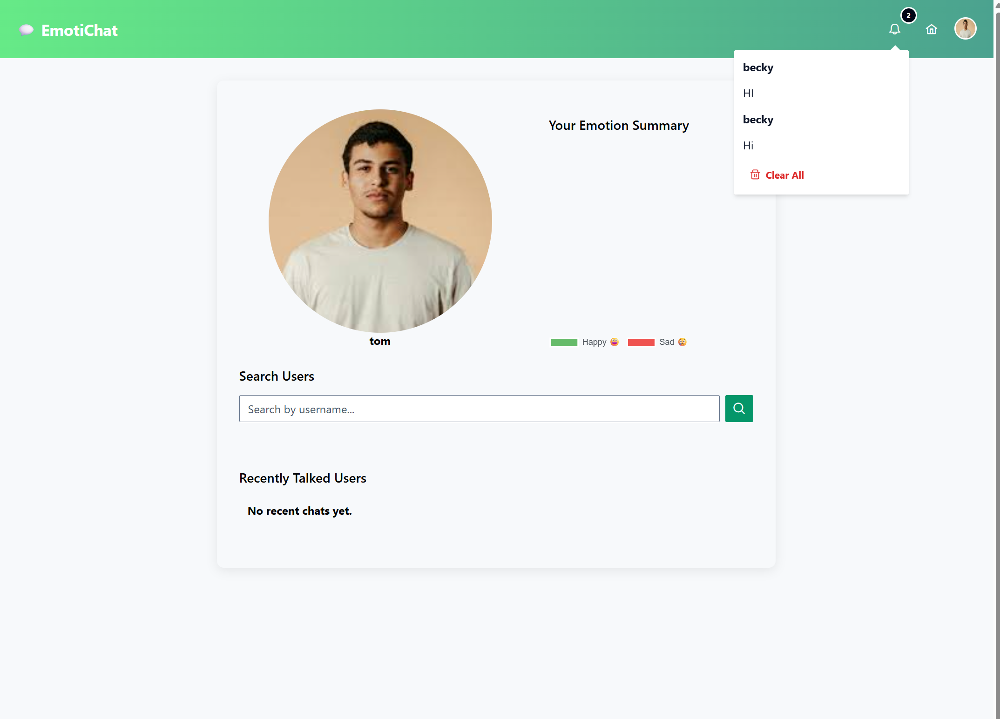
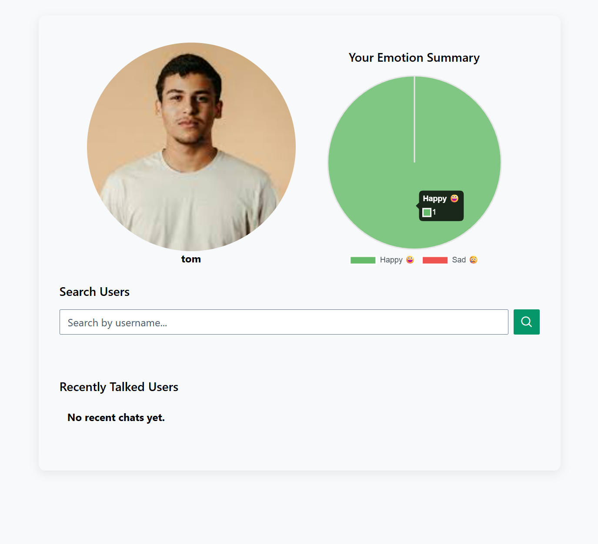

# 💬 Emotion Chat App 🤖💔😄

Welcome to **Emotion Chat App** — a real-time chat app where:
- messages fly instantly 🚀
- emotions get judged by AI 🧠
- and bugs get emotionally analyzed too 😌

⚠️ **Important setup note (read this first!)**  
👉 Backend runs in **Docker**  
👉 Frontend runs **locally** (yes, manually — like a real developer 😎)

---

## ✨ What Can This App Do?

- 🔐 Login & Signup with JWT (no cookies, only trust issues)
- 💬 Real-time 1-to-1 chat using **WebSockets**
- 🧠 Emotion detection for every message (happy, sad… no “angry dev” yet)
- 🔔 Offline notifications (Redis remembers when humans forget)
- 🖼️ User avatars (no more anonymous circles)
- 📊 Emotion summary chart (your emotional damage, visualized)
- 🔍 Search users & jump into chats instantly

---

## 📸 Screenshots

> _Because “it works on my machine” deserves proof._

| Page | Preview |
|-----|--------|
| Search user |  |
| Chat View |  |
| Notification |  |
| Emotion Chart |  |

## 🧰 Tech Stack (aka The Avengers)

### Frontend
- ⚡ Vue 3 (Composition API)
- 🧠 TypeScript
- 🎨 PrimeVue
- ⚙️ Vite

### Backend
- 🚀 FastAPI
- 🔌 WebSockets
- 🐘 PostgreSQL
- 🧠 Redis
- 🔐 JWT Authentication
- 🧪 SQLAlchemy (Async)

### DevOps
- 🐳 Docker & Docker Compose  
  (Backend only — frontend lives free 🕊️)

---

## 📁 Project Structure

```
emotion-chat/
├── backend/        # FastAPI, WebSockets, DB, Redis
├── frontend/       # Vue 3 frontend (run locally)
├── docker-compose.yml
└── README.md       # You are here 👋
```

---

## ✅ Requirements

Before running this masterpiece, make sure you have:

- Docker Desktop 🐳 (running, not just installed)
- Node.js (v18+ recommended)
- npm
- A will to debug if something breaks 😄

---

## 🚀 Step 1: Run Backend (Docker Magic)

From the project root:

```bash
docker-compose up --build
```

This starts:
- FastAPI backend
- Database
- Redis

Backend will be available at:
- 🌐 API: http://localhost:8000
- 📘 Swagger Docs: http://localhost:8000/docs
- 🔌 WebSocket: ws://localhost:8000/ws?token=<JWT>

To stop everything:

```bash
docker-compose down
```

---

## 🌐 Step 2: Run Frontend (Old School Style)

Open **another terminal**:

```bash
cd frontend
npm install
npm run dev
```

Frontend runs at:
- 👉 http://localhost:5173

Yes, backend + frontend run separately.  
Yes, this is intentional.  
Yes, this is character building 💪

---

## 🔌 WebSocket Flow (In Simple Words)

1. User logs in
2. Frontend opens WebSocket connection with JWT
3. Messages are sent instantly
4. If receiver is offline → Redis remembers it
5. When receiver comes online → boom 💥 notifications arrive

No refresh. No polling. Just vibes.

---

## 🖼️ Profile Pictures

- Stored as:
  ```
  /static/uploads/xxxx.jpg
  ```
- Served by FastAPI
- Frontend converts it to:
  ```
  http://localhost:8000/static/uploads/xxxx.jpg
  ```

No broken images. No double slashes. Peace restored ✌️

---

## ⚙️ Frontend Environment Variables (Optional but Clean)

Create `frontend/.env`:

```env
VITE_API_BASE=http://localhost:8000
```

---

## 🧑‍💻 Author

Built with ❤️, ☕, and console.logs  
by **Me**

---

## 📄 License

MIT License  
Do whatever you want, just don’t blame me 😄
